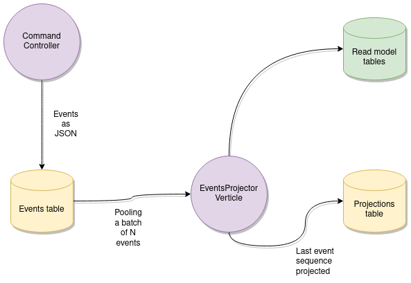

:sourcedir: src/main/java
:source-highlighter: highlightjs
:highlightjsdir: highlight
:highlightjs-theme: rainbow
:revnumber: {project-version}
:example-caption!:
ifndef::imagesdir[:imagesdir: images]
ifndef::sourcedir[:sourcedir: ../../main/java]
:toclevels: 4

https://vertx.io[image:https://img.shields.io/badge/vert.x-4.1.5-purple.svg[Vertx]]
https://github.com/crabzilla/crabzilla/actions/workflows/blank.yml[image:https://github.com/crabzilla/crabzilla/actions/workflows/blank.yml/badge.svg[CI]]
https://codecov.io/gh/crabzilla/crabzilla[image:https://codecov.io/gh/crabzilla/crabzilla/branch/main/graph/badge.svg[codecov]]
https://frontend.code-inspector.com/public/project/24241/crabzilla/dashboard[image:https://www.code-inspector.com/project/24241/score/svg[image]]
https://frontend.code-inspector.com/public/project/24241/crabzilla/dashboard[image:https://www.code-inspector.com/project/24241/status/svg[image]]
https://jitpack.io/#io.github.crabzilla/crabzilla[image:https://jitpack.io/v/io.github.crabzilla/crabzilla.svg[Jitpack]]

== Objectives

. Allows writing a testable `CQRS/ES` model with minimal dependencies.
. Allows handling your commands and save resulting events into `Postgres`.
. Allows projecting events to your read models.

== Overview

You can have many CommandController and EventsProjectionVerticle instances.

== To handle your `command` in a non-blocking way, `Crabzilla` will :

. Validate your https://github.com/crabzilla/crabzilla/blob/main/crabzilla-core/src/main/java/io/github/crabzilla/core/Command.kt[Command] using your implementation of https://github.com/crabzilla/crabzilla/blob/main/crabzilla-core/src/main/java/io/github/crabzilla/core/command/CommandValidator.kt[CommandValidator].
. Lock the target https://github.com/crabzilla/crabzilla/blob/main/crabzilla-core/src/main/java/io/github/crabzilla/core/State.kt[State] instance using https://www.postgresql.org/docs/13/explicit-locking.html#ADVISORY-LOCKS[Postgres Advisory Locks].
. Retrieve the target https://github.com/crabzilla/crabzilla/blob/main/crabzilla-command/src/main/java/io/github/crabzilla/command/internal/Snapshot.kt[Snapshot].
. Handle your `command` and `snapshot.state` using your implementations of https://github.com/crabzilla/crabzilla/blob/main/crabzilla-core/src/main/java/io/github/crabzilla/core/command/CommandHandler.kt[CommandHandler] and https://github.com/crabzilla/crabzilla/blob/main/crabzilla-core/src/main/java/io/github/crabzilla/core/command/EventHandler.kt[EventHandler]:
. Persist (within a db transaction)
.. Optionally persist your `command` as `JSON` to `commands` table.
.. Persist the resulting `events` + metadata as JSON to `events` table.
.. Optionally persist the resulting `snapshot` (`state` and `version`) as JSON to `snapshots` table.
.. Optionally project the resulting events to you read model
. Return a https://github.com/crabzilla/crabzilla/blob/main/crabzilla-core/src/main/java/io/github/crabzilla/core/command/CommandSessionData.kt[CommandSessionData] to the caller.

== Example application

https://github.com/rodolfodpk/accounts2[https://github.com/rodolfodpk/accounts2]

== Status

Seems like is finally reaching stable :)

== More info

https://crabzilla.github.io/crabzilla/docs/index.html[Overview]
